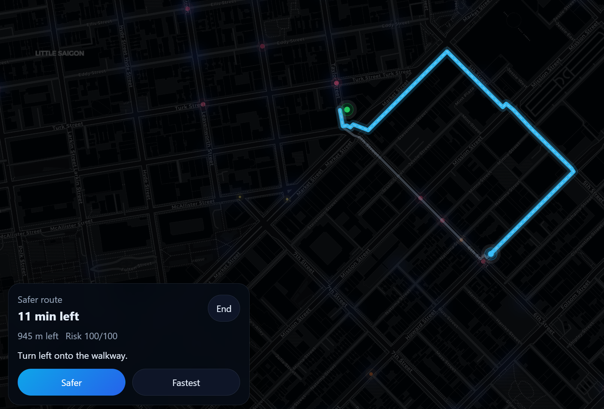

# SafeRoute SF





SafeRoute SF is a zero-build web MVP for **risk-aware walking routes in San Francisco**.
It compares the **fastest** walking route against a **safer trade-off** route by combining:

- **DataSF** public-safety feeds
- **Mapbox** geocoding + walking directions
- **Mistral AI** for the route brief and grounded Q&A

The app is deliberately scoped to **San Francisco only** for a 24h-style MVP.

---

## What it does

- Search an origin and destination inside San Francisco
- Pull multiple walking routes from Mapbox
- Ingest live-ish DataSF safety signals
- Score each route with a transparent heuristic
- Surface:
  - **Fastest route**
  - **Safer route**
  - route risk score
  - key route reasons
  - Mistral-generated explanation
- Ask a grounded free-text question about the current comparison

---

## Stack

- **Backend:** plain Node.js HTTP server, no framework
- **Frontend:** vanilla HTML/CSS/JS
- **Map rendering:** Leaflet + OpenStreetMap tiles
- **Routing + geocoding:** Mapbox APIs
- **AI layer:** Mistral Chat Completions API
- **Data layer:** DataSF / Socrata open data endpoints

No npm install is required for this version.

---

## Project structure

```text
safe-route-sf/
  .env.example
  package.json
  server.mjs
  public/
    index.html
    styles.css
    app.js
```

---

## Environment variables

Copy `.env.example` to `.env` and fill in the keys.

```bash
cp .env.example .env
```

Required for full functionality:

- `MAPBOX_ACCESS_TOKEN`
- `MISTRAL_API_KEY`

Optional:

- `MISTRAL_MODEL` (default: `mistral-medium-latest`)
- `DATASF_APP_TOKEN` for friendlier DataSF rate limits
- `PORT`
- `CACHE_TTL_MS`

---

## Run locally

```bash
node server.mjs
```

Then open:

```text
http://localhost:3000
```

---

## Demo flow

Use this sequence during the pitch/demo:

1. Set **Ferry Building** as origin
2. Set **Dolores Park** as destination
3. Keep **Last 48h** + **Calls + incidents**
4. Click **Compare fastest vs safer**
5. Show:
   - live layer
   - fastest vs safer cards
   - AI brief
6. Ask Mistral:
   - `Why is the faster route riskier tonight?`

That gives you a clean “wow” moment.

---

## Risk scoring heuristic

This MVP does **not** claim to predict crime.
It uses a transparent route scoring approach based on recent public-safety signals.

Very roughly:

- higher severity event types increase weight
- more recent events increase weight
- events closer to the route increase weight
- calls get a slight boost over longer-tail incidents
- night hours add a modest multiplier

Each route then gets:

- raw risk
- normalized risk score (`0-100`)
- top reasons
- top nearby events

Finally, route selection is based on a blend of:

- relative duration
- relative risk

---

## Important product framing

Use this wording:

- **risk-aware routing**
- **safety-informed route**
- **recent public-safety signals**

Avoid saying:

- “crime prediction”
- “this neighborhood is dangerous”
- “this route is safe”

The footer already includes a disclaimer for this reason.

---

## API endpoints

### `GET /api/config`
Returns app config and key availability.

### `GET /api/live?hours=48&source=all&violentOnly=false`
Returns normalized live events from DataSF.

### `GET /api/geocode?q=Ferry%20Building`
Returns geocoded San Francisco results.

### `POST /api/route/compare`
Body:

```json
{
  "origin": { "label": "Ferry Building, San Francisco", "lat": 37.7955, "lng": -122.3937 },
  "destination": { "label": "Dolores Park, San Francisco", "lat": 37.7596, "lng": -122.4269 },
  "windowHours": 48,
  "violentOnly": false
}
```

### `POST /api/ai/ask`
Body:

```json
{
  "question": "Why is the faster route riskier tonight?",
  "routeSummary": { "...": "current route comparison summary" }
}
```

---

## Notes

- The app is intentionally **web-only**.
- It is intentionally **SF-only** for MVP clarity and stronger live data quality.
- The backend contains defensive field parsing because open-data schemas can evolve.
- If `MISTRAL_API_KEY` is missing, the app falls back to a deterministic brief instead of failing.

---

## Next upgrades

If you want to turn this into a stronger startup candidate, the next moves are:

1. Segment-level risk overlays on the route itself
2. Time-of-day previews (“how risky at 11pm?”)
3. Shareable route comparison image cards
4. Personal preferences (“avoid isolated streets”, “avoid vehicle theft hotspots”, etc.)
5. City expansion beyond San Francisco


